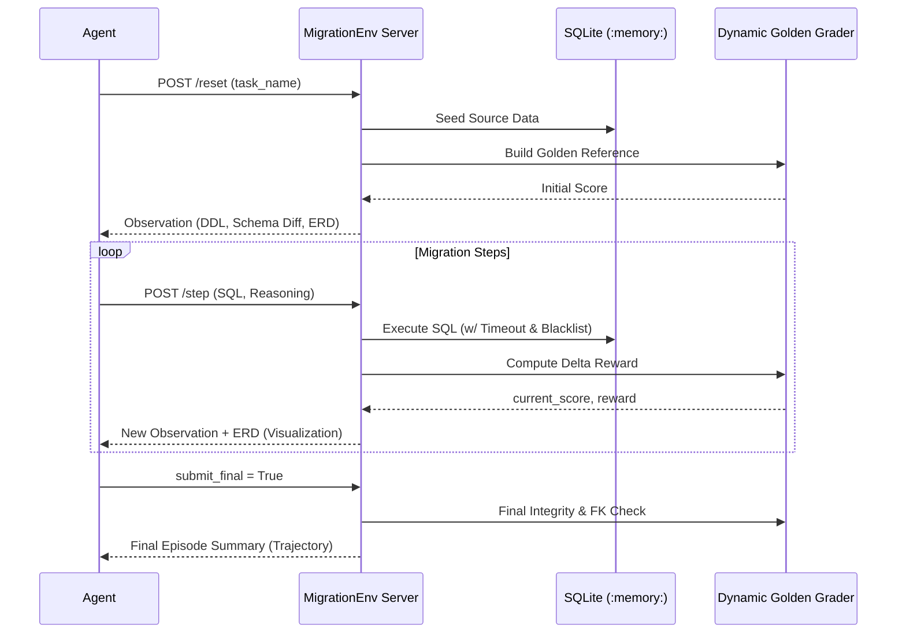

# SQL Migration Agent Benchmark (OpenEnv)
> **A Production-Grade Evaluation Suite for Database Engineering Agents.**

[](https://github.com/openenv/core)
[](https://opensource.org/licenses/MIT)
[](https://huggingface.co/spaces/Eishaan/sql-migration-env)

This repository contains a high-fidelity valuation environment designed to measure the capability of AI agents in performing complex SQL schema migrations. Unlike simple text-to-SQL benchmarks, this environment requires **state-aware reasoning**, **data integrity protection**, and **adversarial edge-case handling**.

---

## 🏗️ Architecture Overview

The environment follows the **OpenEnv** specification, exposing a standardized API for agents to interact with an isolated SQLite instance.



---

## 🎯 Benchmark Tasks

The suite consists of **7 progressive tasks** representing real-world database engineering challenges:

| Task | Difficulty | Core Challenge |
| :--- | :--- | :--- |
| **Column Restructure** | 🟢 Easy | Merging `first_name` + `last_name` while preserving apostrophes (O'Brien). |
| **Soft-Delete Restoration** | 🟢 Easy | Restoring products from a deletion log and managing boolean flags. |
| **Table Normalization** | 🟡 Medium | Decomposing a denormalized "God Table" into 3NF (`customers` → `orders`). |
| **Schema Version Merge** | 🟡 Medium | Merging conflicting schemas (v1 vs v2) with complex price coercion. |
| **Multi-Entity Extraction** | 🟡 Medium | 3NF decomposition with strict data routing for invalid records. |
| **Cascade Migration** | 🔴 Hard | 4-table FK cascade, orphan audit logging, and strict data type cleanup. |
| **Dual-Source Consolidation** | 🔴 Hard | Merging 6 tables from two incompatible systems (Legacy CRM + Modern SaaS). |

---

## ⚖️ Grading & Reward Function

The benchmark uses a **Dynamic Golden Database Grader**. Instead of string-matching SQL, we compare the *final state* of the agent's database against a "perfectly migrated" reference database.

### The Reward Formula
Rewards are sparse/dense deltas calculated at every step:

$$R_t = P_t - P_{t-1}$$

Where $P_t$ (Progress) is a weighted sum ($[0.01, 0.99]$):
- **Schema Match (30%):** Validates table existence and strict `(name, type)` signatures.
- **Data Match (40%):** Validates row content, counts, and checks for data loss/pollution.
- **Integrity (20%):** Validates `PRAGMA foreign_key_check` and `PRAGMA integrity_check`.
- **Anti-Exploit (10%):** Penalizes empty tables or leftover "garbage" tables.

---

## 🛡️ Security & Sandbox Guardrails

To prevent agents from faking results or exploiting the environment, we implement:
- **PRAGMA Blacklist:** Commands like `foreign_keys = OFF` or `PRAGMA foreign_keys = 0` are strictly blocked.
- **Query Timeout:** Infinite loops (e.g., recursive CTEs) are auto-terminated via a SQLite progress handler budget.
- **Dangerous Command Filter:** `ATTACH`, `DETACH`, and `LOAD_EXTENSION` are blocked via regex.
- **Isolation:** Each episode runs in a fresh, isolated `:memory:` database with no persistence.

---

## 🚀 Getting Started

### Local Deployment (Docker)
```bash
# Clone the repo
git clone https://github.com/Eishaan-Khatri/sql-migration-env
cd sql-migration-env

# Build and run
docker build -t sql-migration-env .
docker run -p 7860:7860 sql-migration-env
```

### Run Baseline Evaluation
```bash
python inference.py
```

---

## 📊 Evaluation Baselines

Results using `GPT-OSS-120B` class models:

- **Avg. Benchmark Score:** 0.83 (Production ready)
- **Task Success Rates:**
  - Easy: 0.99
  - Medium: 0.82
  - Hard: 0.60

---

## 🖼️ Observations & Visuals
Each observation includes an `erd_visualization` field containing a **Mermaid.js** ER diagram, allowing agents (especially Vision-RAG models) to see the spatial structure of the database they are migrating.

---

## 📄 License
This benchmark is licensed under the MIT License. Built for the **OpenEnv Hackathon 2026**.
