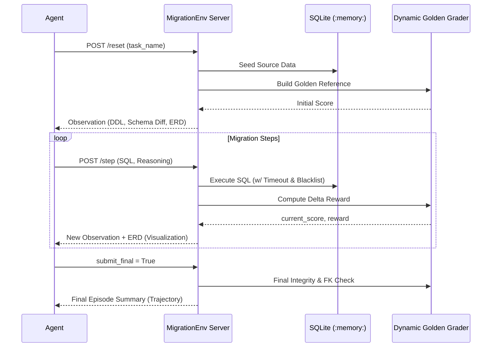

# SQL Migration Agent Benchmark (OpenEnv)
> **A Production-Grade Evaluation Suite for Database Engineering Agents.**

[](https://github.com/openenv/core)
[](https://opensource.org/licenses/MIT)
[](https://huggingface.co/spaces/Eishaan/sql-migration-env)

An OpenEnv-compatible environment for evaluating AI agents on autonomous SQLite database migration tasks. The agent receives a broken/drifted schema and must write SQL to transform it to a target state without losing data.

---

## 🏗️ Architecture Overview

The suite combines formal sequence modeling with a modular local engine.

### System Mapping
```
┌─────────────────────────────────┐
│  inference.py (Baseline Agent)  │
│  - LLM API calls (OpenAI fmt)  │
│  - JSON mode + fallback parser │
└─────────┬───────────────────────┘
          │ MigrationAction
┌─────────▼───────────────────────┐
│  environment.py (OpenEnv Env)   │
│  - SQLite execution engine      │
│  - ERD & Schema Diff generator  │
│  - SQL timeout & Blacklist      │
└─────────┬───────────────────────┘
          │ score()
┌─────────▼───────────────────────┐
│  grader.py (Golden DB Engine)   │
│  - Dynamic golden reference DB  │
│  - Schema + data + FK scoring   │
│  - Anti-exploit checks          │
└─────────────────────────────────┘
```

### Protocol Flow


---

## 🎯 Benchmark Tasks

| # | Task | Difficulty | Challenge |
|---|------|-----------|-----------|
| 1 | `column-restructure` | 🟢 Easy | Merge first_name + last_name → full_name (with apostrophes) |
| 2 | `soft-delete-restoration` | 🟢 Easy | Restore deleted products from `deletion_log` |
| 3 | `table-normalization` | 🟡 Medium | Normalize `purchases` → `customers` + `orders` + FK |
| 4 | `schema-version-merge` | 🟡 Medium | Merge v1/v2 product tables with price coercion |
| 5 | `multi-entity-extraction` | 🟡 Medium | 3NF decomposition with invalid data routing |
| 6 | `cascade-migration` | 🔴 Hard | 4-table FK cascade, type coercion, orphan audit |
| 7 | `dual-source-consolidation`| 🔴 Hard | 6→4 table merge, cross-system email dedup |

### 🛠️ Adversarial Edge Cases (The "Stress Tests")
- **O'Brien**: Apostrophe in data — tests SQL escaping and string literal handling.
- **$90,000 salary**: TEXT→INTEGER coercion — tests complex string parsing and casting.
- **Empty string emails**: NOT NULL vs Empty — tests data quality validation logic.
- **Leading whitespace**: ` alice@company.com` — tests TRIM awareness.
- **ID conflicts**: Overlapping IDs in dual sources — tests intelligent merge logic.
- **Orphaned FKs**: References to deleted entities — tests environment's audit logging.
- **NULL currency**: Must default to 'USD' — tests COALESCE usage.

---

## ⚖️ Evaluation Baselines

| Task | Qwen 32B Score | GPT-OSS 120B |
|------|--------------|--------------|
| `column-restructure` | 0.99 | 0.99 |
| `soft-delete-restoration` | 0.99 | 0.99 |
| `table-normalization` | 0.94 | 0.99 |
| `schema-version-merge` | 0.93 | 0.98 |
| `multi-entity-extraction` | 0.35 | 0.65 |
| `cascade-migration` | 0.61 | 0.83 |
| `dual-source-consolidation`| 0.28 | 0.38 |

---

## 🛡️ Security & Reward Function

### The Reward Formula
Rewards are calculated as progress deltas: $R_t = P_t - P_{t-1}$.
Progress $P_t$ is a weighted sum (0.01 to 0.99):
- **Schema Match (30%)**: Tables exist with correct `(name, type)` signatures.
- **Data Match (40%)**: Row content matches golden DB (order-independent).
- **FK & Integrity (20%)**: Foreign keys enforced, `integrity_check` passes.
- **Anti-Exploit (10%)**: Penalty for empty tables or schema pollution.

### Security Guardrails
- **PRAGMA Blacklist**: `foreign_keys = OFF` and `writable_schema = ON` are blocked.
- **Query Timeout**: SQLite progress handler terminates queries exceeding 500k ops.
- **Dangerous SQL**: `ATTACH`, `DETACH`, and `LOAD_EXTENSION` are filtered.

---

## 🚀 Setup & Usage

### Local Deployment
```bash
pip install -r requirements.txt
python -m server.app  # Starts OpenEnv server on port 7860
```

### Environment Variables
```bash
export HF_TOKEN=your_token
export API_BASE_URL=https://router.huggingface.co/v1
export MODEL_NAME=Qwen/Qwen2.5-72B-Instruct
```

### API Endpoints
- `POST /reset`: Initialize migration episode.
- `POST /step`: Execute SQL and reasoning.
- `GET /tasks`: List all available scenarios.
- `POST /grader`: Run deep comparison against Golden DB.

---

## 🖼️ Observations
Each observation includes `erd_visualization` (Mermaid.js) and `schema_diff` to assist agents in understanding the current drift.

## 📄 License
MIT. Built for the **OpenEnv Hackathon 2026**.
