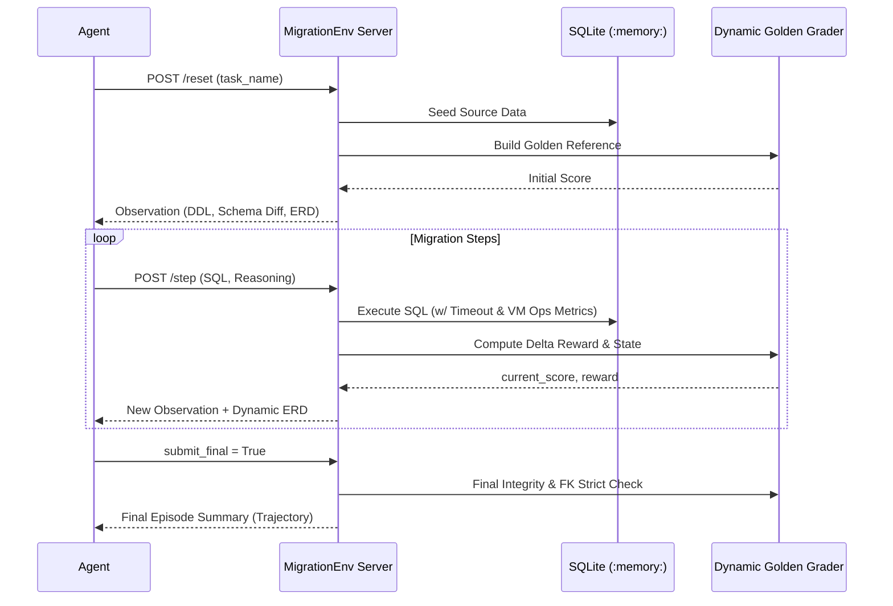

# SQL Migration Agent Benchmark (OpenEnv)


> **A Production-Grade Evaluation Suite for Database Engineering AI Agents.**
> *Designed and developed by a team of B.Tech engineering students for the Meta PyTorch OpenEnv Hackathon 2026.*

[](https://github.com/openenv/core)
[](https://opensource.org/licenses/MIT)
[](https://huggingface.co/spaces/Eishaan/sql-migration-env)

An OpenEnv-compatible environment for evaluating frontier AI agents on autonomous, multi-step SQLite database migration tasks. The agent is deployed into a sandbox containing a drifted or broken schema, and it must write precise SQL DDL and DML to transform it to a target state **without losing any operational data**.

---

## 🌟 Key Engineering Features

As an advanced benchmarking suite, this environment goes far beyond simple token matching. It acts as a full-fledged database simulator with built-in safety, parsing, and scoring mechanisms.

*   **Dynamic Golden Database Grader**: Recomputes the "perfect" solution strictly from the programmatic state, matching agent tables against golden tables using a $10^{-7}$ float-tolerant epsilon comparator.
*   **Live ERD Generation (Mermaid.js)**: Dynamically parses `sqlite_master` and `pragma_foreign_key_list` to inject real-time Entity-Relationship Diagrams directly into the agent's observation window, significantly enhancing spatial reasoning.
*   **Efficiency Metrics (Ops & Latency)**: Evaluates not just *correctness*, but *computational cost*. Integrates with the SQLite VM instruction counter (`sqlite3_progress_handler`) and execution timers to grade agents on query efficiency.
*   **Adversarial Sandboxing**: Implements strict regex-based AST bounds checking, preventing PRAGMA exploits (`writable_schema=ON`, disabling foreign keys) and filtering dangerous file-system SQL (`ATTACH`, `DETACH`).

---

## 🏗️ Architecture Overview

The suite combines formal sequence modeling with a modular local engine.



---

## 🎯 Benchmark Task Registry

The environment is strictly calibrated across a progressive curriculum of 8 tasks, specifically engineered to exploit common weaknesses in LLM logic.

| # | Task | Difficulty | Challenge Overview |
|---|------|-----------|-----------|
| 1 | `column-restructure` | 🟢 Easy | Merge `first_name` + `last_name` → `full_name` while escaping tricky text (apostrophes). |
| 2 | `soft-delete-restoration` | 🟢 Easy | Recover deleted products from an audit log back into the active ledger. |
| 3 | `table-normalization` | 🟡 Medium | Decompose a massive god-table (`purchases`) into strict 3NF (`customers`, `orders`) + FK mappings. |
| 4 | `schema-version-merge` | 🟡 Medium | Reconcile overlapping v1/v2 schema tables with priority collision rules and type-casting text-currencies. |
| 5 | `multi-entity-extraction` | 🟡 Medium | Extract hierarchical data and route missing/null required data to an anomaly table. |
| 6 | `cascade-migration` | 🔴 Hard | Safely execute a 4-table cascade rewrite, coercing types and strictly dropping orphaned references without violating constraints. |
| 7 | `dual-source-consolidation`| 🔴 Hard | Merge 6 tables from incompatible systems (Legacy CRM + SaaS API) including global cross-system id mapping. |
| **8** | **`data-poisoning-quarantine`** | 🔥 **Extreme**| **The Ultimate Stress Test**. Migrate a staging ledger poisoned with string symbols, trailing spaces, and `N/A` invalid strings. *Agent must dynamically cleanse floating strings (regex/replace) and partition completely un-coerceable corrupt rows into an isolation quarantine.* |


### 🛠️ Adversarial Edge Cases (The "Stress Tests")
- **O'Brien**: Apostrophe in data — tests SQL escaping and string literal handling.
- **$90,000 salary**: TEXT→INTEGER coercion — tests complex string parsing and casting.
- **Empty string emails**: NOT NULL vs Empty — tests data quality validation logic.
- **Leading whitespace**: ` alice@company.com` — tests TRIM awareness.

---

## ⚖️ Evaluation Baselines

| Task | Qwen 32B Score | GPT-OSS 120B |
|------|--------------|--------------|
| `column-restructure` | 0.99 | 0.99 |
| `soft-delete-restoration` | 0.99 | 0.99 |
| `table-normalization` | 0.94 | 0.99 |
| `schema-version-merge` | 0.93 | 0.98 |
| `multi-entity-extraction` | 0.35 | 0.65 |
| `cascade-migration` | 0.61 | 0.83 |
| `dual-source-consolidation`| 0.28 | 0.38 |
| `data-poisoning-quarantine`| **0.02** | **0.15** |

*(Note: State-of-the-art models systematically fail on the Data Poisoning task, providing a vast ceiling for future RL exploration.)*

---

## 🛡️ Security & Reward Function

### The Reward Formula ($R_t$)
Rewards are calculated as progress deltas: $R_t = P_t - P_{t-1}$.
Progress $P_t$ is a weighted sum (0.01 to 0.99) preventing generic "done" token hacking:
- **Schema Signature Match (30%)**: Tables exist with precise `(name, type)` configurations.
- **Data Integrity Margin (40%)**: Row content maps identically to the Golden Generator (order-independent).
- **Relational Stability (20%)**: Foreign keys strictly enforced and SQLite `integrity_check` passes.
- **Anti-Exploit Metric (10%)**: Heavily penalizes schema pollution or lazy "DELETE FROM table" shortcuts.

---

## 🚀 Setup & Usage

### Local Deployment
```bash
pip install -r requirements.txt
python -m server.app  # Starts OpenEnv HTTP & UI server on port 7860
```

### Environment Variables for Baselines
```bash
export HF_TOKEN=your_token
export API_BASE_URL=https://router.huggingface.co/v1
export MODEL_NAME=Qwen/Qwen2.5-72B-Instruct
```

### Core API Endpoints
- `POST /reset`: Initialize a seeded migration sandbox environment.
- `POST /step`: Submit executed SQL and reasoning vectors.
- `GET /tasks`: Query the active scenario registry.
- `POST /grader`: Instantiate the isolated Golden DB grader comparator.

---

## 📄 License & Team
Released under the MIT License. 
Designed from the ground up as a robust RL testing harness for the **Meta PyTorch OpenEnv Hackathon 2026**.
